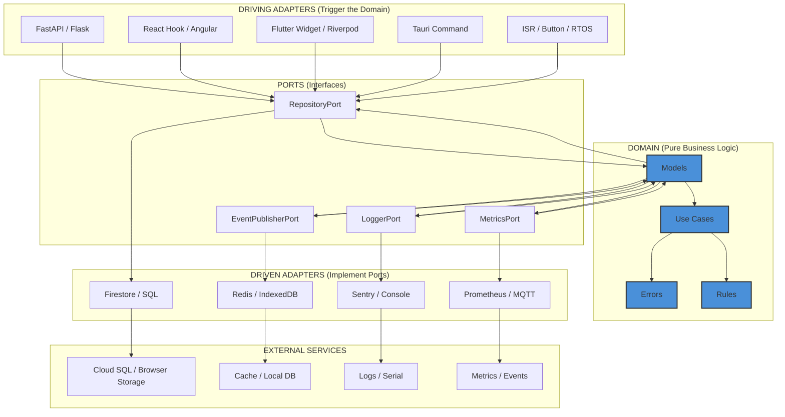
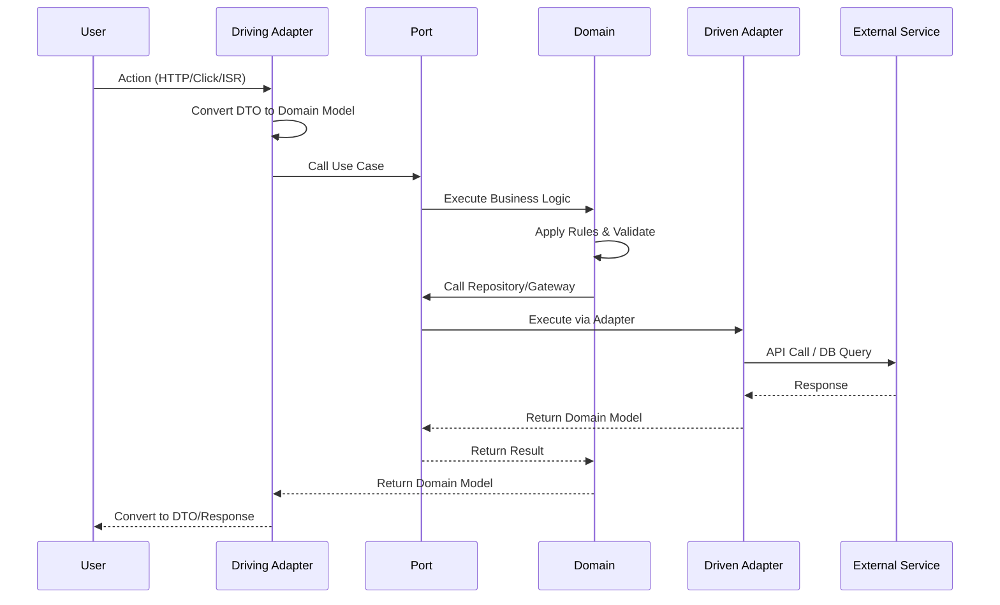
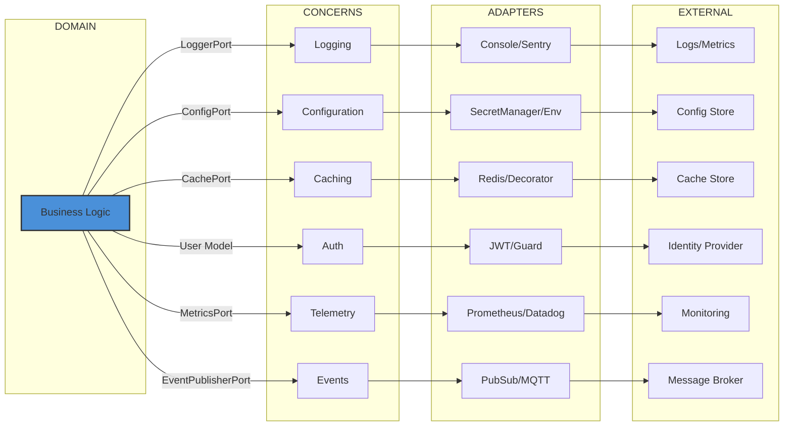
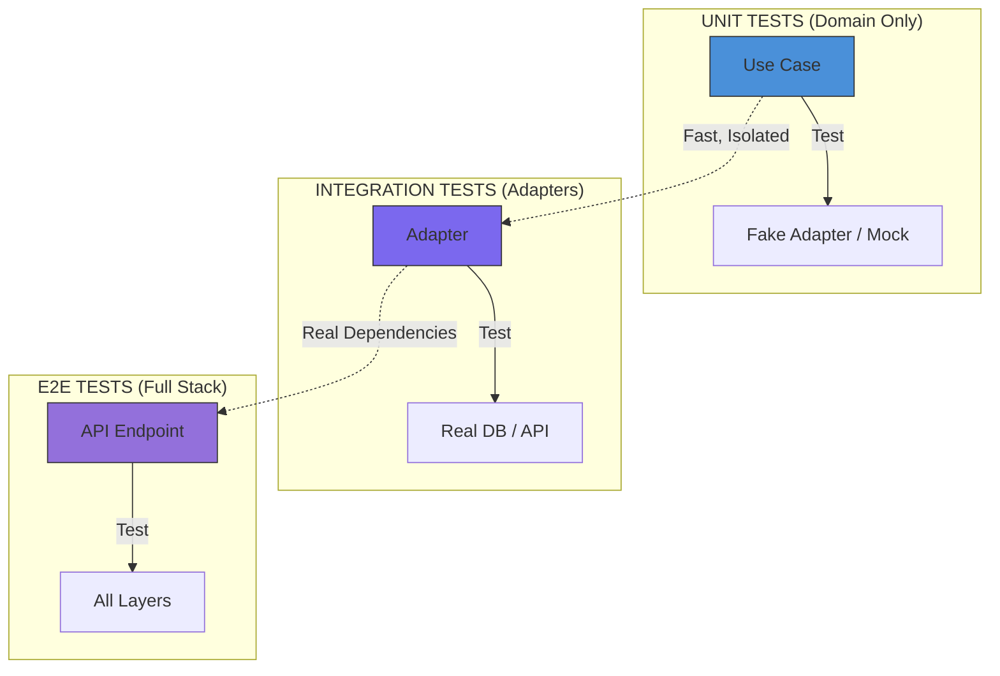
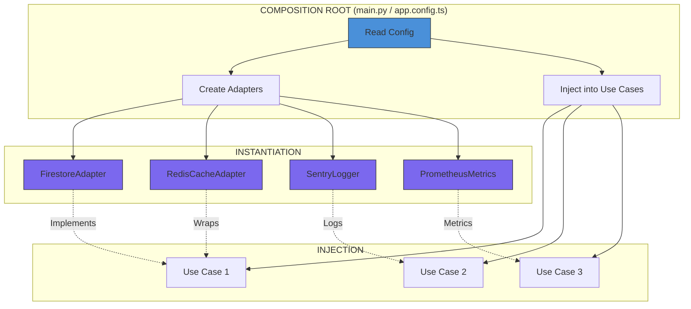
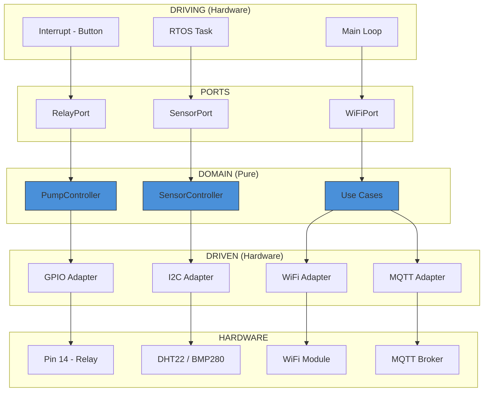

# Hexagonal Architecture - Visual Overview

## Core Architecture

## Request Flow

## Cross-Cutting Concerns

## Testing Layers

## Stack-Specific Architecture

```mermaid
graph TB
    subgraph "BACKEND (Python/GCloud)"
        B1[FastAPI] --> B2[Domain]
        B2 --> B3[Firestore]
        B2 --> B4[Cloud Tasks]
        B2 --> B5[Cloud SQL]
    end

    subgraph "FRONTEND (React/Angular)"
        F1[Component/Hook] --> F2[Domain]
        F2 --> F3[localStorage]
        F2 --> F4[IndexedDB]
        F2 --> F5[fetch API]
    end

    subgraph "MOBILE (Flutter)"
        M1[Widget/Riverpod] --> M2[Domain]
        M2 --> M3[Geolocator]
        M2 --> M4[Hive]
        M2 --> M5[HTTP Client]
    end

    subgraph "DESKTOP (Tauri)"
        DT1[Tauri Command] --> DT2[Rust Domain]
        DT2 --> DT3[File System]
        DT2 --> DT4[System Tray]
        DT2 --> DT5[IPC to Angular]
    end

    subgraph "EMBEDDED (ESP32)"
        E1[ISR/Button] --> E2[Domain]
        E2 --> E3[GPIO/I2C]
        E2 --> E4[MQTT]
        E2 --> E5[WiFi]
    end

    style B2 fill:#4a90d9,stroke:#333
    style F2 fill:#4a90d9,stroke:#333
    style M2 fill:#4a90d9,stroke:#333
    style DT2 fill:#4a90d9,stroke:#333
    style E2 fill:#4a90d9,stroke:#333
```

## Dependency Injection Flow

## ESP32 Hexagonal Flow

